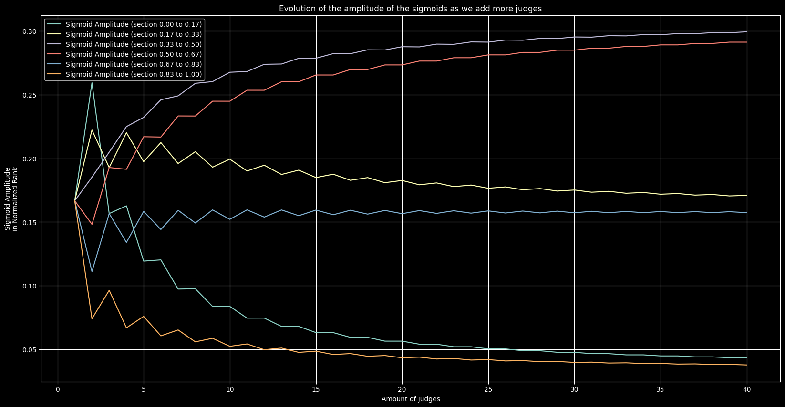

# Scalar Merit Study

## Goal

The goal is to compute a meaningful _scalar merit_ value for each _merit profile_, so that [Majority Judgment](https://en.wikipedia.org/wiki/Majority_judgment) (MJ) may be used in [proportional representation](https://en.wikipedia.org/wiki/Proportional_representation).

## Merit from Absolute Rank

Every merit profile has an _absolute rank_, which is its rank in the MJ poll where all possible merit profiles (with the same amount of grades and judges) compete.

A simple formula for a _scalar merit_ can therefore be:

$$
Scalar\ Merit = Amount\ of\ Possible\ Merit\ Profiles - Absolute\ Rank
$$

Sadly, the amount of possible merit profiles for a given amount of judges and grades grows big quite fast.  Too fast.

> 💡 Mathematically, a Merit Profile is a [Multiset](https://en.wikipedia.org/wiki/Multiset), so some work has been laid out already.

$Amount\ of\ Possible\ Merit\ Profiles = \left({n \choose k}\right) = {n+k-1 \choose k} = \frac{(n+k-1)!}{k!\,(n-1)!} = {n(n+1)(n+2)\cdots(n+k-1)\over k!}$

Where:

$$n = Amount\ of\ Grades = 7\ for\ example$$
$$k = Amount\ of\ Judges = 40\ for\ example$$


Let's hack some Python to see how the amount of possible merit profiles behave:


```python
# Partial factorial ; set begin=1 for the regular factorial.
def factorial(begin: int, end: int) -> int:
    assert(0 < begin <= end)
    product: int = end
    for coeff in range(begin, end):
        product *= coeff
    return product


# https://en.wikipedia.org/wiki/Multiset
# Returns the number of multisets of cardinality k, with elements taken from a finite set of cardinality n.
def multiset_coefficient(n: int, k: int) -> int:
    assert(n > 0 and k > 0)
    return factorial(n, n + k - 1) // factorial(1, k)
```


```python
multiset_coefficient(7, 40)  # Amount of possible merit profiles for 7 grades and 40 judges
```

    9366819


Ranking 10 million merit profiles is still manageable, but what happens when you have $160\ 000$ judges ?


```python
lots = multiset_coefficient(7, 160_000)
print(len(str(lots)), "digits is too many fingers")
lots
```

    29 digits is too many fingers
    23304747394848625835520392001


> 🔔 Now, **that's too many** merit profiles to rank them all in a single MJ poll in order to compute their absolute rank.

Just for completion's sake, let's see how the amount of possible merit profiles grows with the amount of judges:


```python
import matplotlib.pyplot as plt
import numpy as np

# Configure the plots
plt.style.use('dark_background')
plt.rcParams['figure.figsize'] = [20, 10]
```


```python
sampling_size = 1000
sampling = np.arange(1, sampling_size)

# Oddity: this throws "RuntimeWarning: overflow encountered in scalar multiply"
#print([multiset_coefficient(7, i) for i in sampling])

# List of the amount of possible merit profiles, indexed by judges' amount, starting at 1.
# Not using the comprehension syntax because it overflows, somehow.
multiset_coefficients = []
for i in range(1, sampling_size):
    multiset_coefficients.append(multiset_coefficient(7, i))

from matplotlib.ticker import StrMethodFormatter

plt.title("Evolution of the Amount of Possible Merit Profiles\nas the Amount of Judges increase, for 7 Grades")
plt.gca().yaxis.set_major_formatter(StrMethodFormatter('{x:,.0f}'))
plt.xlabel("Amount of Judges")
plt.ylabel("Amount of Possible Merit Profiles")
plt.plot(
    sampling,
    multiset_coefficients,
)
plt.show()
```


    

    


As you can see, the numbers quickly grow to cosmic scales, and therefore this trivial technique for computing the _merit scalar_ of a merit profile won't "work" in practice, as sorting $10\ 000\ 000$ merit profiles using MJ already takes about a minute.

Despair not, because if we can find an isomorphism of this technique that we _can_ compute, we'll manage.

> Enters _Marc Paraire_.

## Merit from Signed Base

_Marc Paraire_ found a way to compute a meaningful, isomorphic merit scalar for a given merit profile.

> 🎉 This is amazing, as it unlocks proportional representation using Majority Judgment.

> _Signed Base_ is not a great name, but I do need one ; please share your ideas.

We will study how that scalar merit is distributed over all possible merit profiles, and how the amount of grades and participants affect it.

> We will focus on 7 grades for now, for simplicity's sake.

Let's start by checking out the algorithm for computing that merit scalar :


### Overview of the Algorithm


#### Decision Score

> Not fond of the name, feel free to suggest another.  _Decision Strength_ ? … <small>Meh</small>.

It's the **size of the biggest group** outside of the median grade, signed.
It's positive if it is an _adhesion group_ (higher than the median), and negative if it's a _contestation group_.

This value will always be in the range $]-\frac{Amount\ of\ Judges} 2, \frac{Amount\ of\ Judges} 2]$, which is why using a base $Amount\ of\ Judges$ works so well.


### Collect the Data

The `CSV` files were generated using _Java_, following these steps:

1. Generate all possible merit profiles for $7$ grades and $k$ judges.
2. Rank them using _Majority Judgment_.
3. Compute their individual _Scalar Merit_ using the _Signed Base_ technique.
4. Generate a `CSV` file.

> Generating this data using Python would be better, but we need to improve the Python MJ library first.


```python
from tools import read_data, deviation_between, affine_data, np_sigmoid

# Datasets we want to use
grades_amount = 7  # I've only generated the datasets for 7 grades
distributions_to_plot = [
    { 'grades': grades_amount, 'judges':  i } for i in range(1, 41)
]

# Read data from CSV(s)
rank_datas = []
merit_datas = []
for i, config in enumerate(distributions_to_plot):
    merit_data, rank_data = read_data(
        "./merit_distribution_%d_grades_%d_judges.csv"%(config['grades'], config['judges']),
        limit = 0,
    )
    rank_datas.append(rank_data)
    merit_datas.append(merit_data)
```

### Plot the Merit

Here, we're going to plot the merits for various $K$ judges.


```python
plt.title("Merit Distribution (%d grades)" % (grades_amount,))

# Axes Configuration
plt.xlabel('rank')
plt.xticks([0.0, 0.5, 1.0], ["Best", "Middle", "Worst"])
plt.ylabel('merit (normalized)')
plt.yticks(
    np.linspace(0.0, 1.0, grades_amount),
    ["0"] + ["%d/%d" % (i, grades_amount - 1) for i in range(1, grades_amount - 1)] + ["1"],
)

for i, config in enumerate(distributions_to_plot):
    plt.plot(
        rank_datas[i], merit_datas[i],
        marker='.',
        ls='None',
        label="Raw Merit %d judges (σ=%.2f%%)" % (
            config['judges'],
            deviation_between(merit_datas[i], affine_data(rank_datas[i])) * 100.0,
        ),
    )

# Ideal Affine Data
plt.plot(
    rank_datas[0], affine_data(rank_datas[0]),
    label="Ideal Affine Merit (σ=0%)",
)

plt.grid()
plt.legend(loc='center left', bbox_to_anchor=(1, 0.5))
plt.show()
```


    

    


Observations:

- the amount of judges changes the shape of the curve
- the shape seems to converge as we add more and more judges
- the multiples of $\frac 1 6$ are the merit profiles with 100% of the judges casting the same grade

We can also observe that the distribution is not affine (linear), as it would be with _Merit from Absolute Rank_, except in the trivial case with only $1$ judge.


### Adjusting the Merit Curve to make it Affine

If we can approximate well enough the inverse with an analytical function, we can adjust the merit curve to make it affine.

The first step is to fit the inverse, then.

### Fitting the Inverse

Let's start by plotting the inverses :


```python
plt.title("Merit Inverses (%d grades)" % (grades_amount,))

# Axes Configuration
plt.xlabel('merit (normalized)')
plt.xticks(
    np.linspace(0.0, 1.0, grades_amount),
    ["0"] + ["%d/%d" % (i, grades_amount - 1) for i in range(1, grades_amount - 1)] + ["1"],
)
plt.ylabel('rank')
plt.yticks([0.0, 0.5, 1.0], ["Best", "Middle", "Worst"])


for i, config in enumerate(distributions_to_plot):
    if i > 10 and i < 39 : continue
    plt.plot(
        merit_datas[i], rank_datas[i],
        marker='.',
        ls='None',
        label="Raw Merit %d judges (σ=%.2f%%)" % (
            config['judges'],
            deviation_between(merit_datas[i], affine_data(rank_datas[i])) * 100.0,
        ),
    )

# Ideal Affine Data
plt.plot(
    rank_datas[0], affine_data(rank_datas[0]),
    label="Ideal Affine Merit (σ=0%)",
)

plt.grid()
plt.legend(loc="upper right")
plt.show()
```


    

    


We can fit the curve for a given amount of judges using a sigmoïd series.

For example, for $17$ judges :


```python
plt.title("Hand-Fitting a Sigmoid Series\non the Merit Inverse")

# Hand fitted for 17 judges
def sigmoid_hand_model(amount_of_judges):
    tightness = 96
    amplis = [0.358682, 1.09248, 1.69632, 1.61568, 0.95616, 0.2808]
    return (1.0/6.0) * sum(
        amplis[i] * np_sigmoid(merit_datas[amount_of_judges-1], tightness=tightness, origin=(2.0*i+1.0)/12.0)
        for i in range(6)
    )

model_17 = sigmoid_hand_model(17)
model_11 = sigmoid_hand_model(11)
model_40 = sigmoid_hand_model(40)

# Axes Configuration
plt.xlabel('merit (normalized)')
plt.xticks(
    np.linspace(0.0, 1.0, grades_amount),
    ["0"] + ["%d/%d" % (i, grades_amount - 1) for i in range(1, grades_amount - 1)] + ["1"],
)
plt.ylabel('rank')
plt.yticks([0.0, 0.5, 1.0], ["Best", "Middle", "Worst"])

# Data 17 judges
plt.plot(
    merit_datas[16], rank_datas[16],
    marker='.',
    ls='None',
    label="Raw Merit %d judges (σ=%.2f%%)" % (
        17,
        deviation_between(rank_datas[16], model_17) * 100.0,
    ),
)

# Data 11 judges
plt.plot(
    merit_datas[10], rank_datas[10],
    marker='.',
    ls='None',
    label="Raw Merit %d judges (σ=%.2f%%)" % (
        10,
        deviation_between(rank_datas[10], model_11) * 100.0,
    ),
)

# Data 40 judges
plt.plot(
    merit_datas[39], rank_datas[39],
    marker='.',
    ls='None',
    label="Raw Merit %d judges (σ=%.2f%%)" % (
        39,
        deviation_between(rank_datas[39], model_40) * 100.0,
    ),
)

# Hand fitted model (for 17 judges)
plt.plot(merit_datas[16],
         model_17,
         'r-',
         label="Hand-Fitted Model for 17 judges",
)

plt.grid()
plt.legend(loc="upper right")
plt.show()
```


    

    


Since the amount of judges changes the "amplitude" of the sigmoids, let's study how the amplitude of the sigmoids behave when the amount of judges change :


```python
plt.title("Evolution of the amplitude of the sigmoïds as we add more judges")
plt.xlabel("Amount of Judges")
plt.ylabel("Sigmoid Amplitude\nin Normalized Rank")

whole_merits = np.linspace(0.0, 1.0, grades_amount)
for whole_merit_index, section in enumerate(whole_merits[:-1]):
    next_section = whole_merits[whole_merit_index+1]
    sigmoid_amplitudes = [
        np.interp(section, merit_datas[i][::-1], rank_datas[i][::-1]) - np.interp(next_section, merit_datas[i][::-1], rank_datas[i][::-1])
        for i in range(len(merit_datas))
    ]
    
    plt.plot(
        [d['judges'] for d in distributions_to_plot],
        sigmoid_amplitudes,
        label="Sigmoid Amplitude (section %.2f to %.2f)" % (section,next_section),
    )

plt.grid()
plt.legend()
plt.show()
```


    

    


Wow.  If we want to model these curves, we should ignore all the cases below, let's say, $10$ judges, because of the chaotic behavior of the curves and the fact that $10$ judges yield $8008$ possible merit profiles, and so we can embed the data in the algorithm and compute directly the _absolute rank_ of each profile, which is already the best merit scalar we can compute.

### Empirically Fitting the Sigmoids' Amplitudes


```python
import math
from symfit import parameters, variables, sin, cos, exp, Fit, Eq, Le
from symfit.core.minimizers import BasinHopping, BFGS, SLSQP

plt.title("Fitting the sigmoïds' amplitudes")
plt.xlabel("Amount of Judges")
plt.ylabel("Sigmoid Amplitude\nin Normalized Rank")

skip_first_n = 4

judges_data = np.array([d['judges'] for d in distributions_to_plot[skip_first_n:]])
sigmoids_amplitudes = []

# Sigmoid Amplitude Model
x, y = variables('x, y')
coeff, offset, origin = parameters('coeff, offset, origin')
sin_phase, sin_ampli, sin_origin = parameters('sin_phase, sin_ampli, sin_origin')
sigmampli_model_dict = {
    y: (
        coeff / (x - origin) + offset + sin_ampli * sin(x * math.pi + sin_phase) / (x - sin_origin)
    ),
}
sigmampli_params = []

sections = np.linspace(0.0, 1.0, grades_amount)
for section_index, section in enumerate(sections[:-1]):
    next_section = sections[section_index + 1]
    sigmoid_amplitudes = np.array([
        np.interp(section, merit_datas[i][::-1], rank_datas[i][::-1]) - np.interp(next_section, merit_datas[i][::-1], rank_datas[i][::-1])
        for i in range(skip_first_n, len(merit_datas))
    ])
    sigmoids_amplitudes.append(sigmoid_amplitudes)

    # Plot the Data
    plot_lines = plt.plot(
        judges_data,
        sigmoid_amplitudes,
        marker='.',
        ls='None',
        label="Sigmoid Amplitude (section %.2f to %.2f)" % (section, next_section),
    )
    section_color = plot_lines[0].get_color()

    # Fit our Model to the Data
    fit = Fit(
        sigmampli_model_dict,
        x=judges_data,
        y=sigmoid_amplitudes,
        minimizer=[BasinHopping, SLSQP],
    )
    fit_result = fit.execute(BasinHopping={'niter': 300})
    sigmampli_params.append(dict(fit_result.params))

    # Plot the Model
    plt.plot(
        judges_data,
        fit.model(x=judges_data, **fit_result.params).y,
        ls='--',
        color=section_color,
        label="Model σ=%.2f%%" % (
            deviation_between(fit.model(x=judges_data, **fit_result.params).y, sigmoid_amplitudes)*100.0,
        ),
    )

    # Plot the Model Asymptote
    plt.plot(
        judges_data,
        np.full(judges_data.shape, fit_result.params['offset']),
        color=section_color,
        ls="-.",
        label="Model Asymptote at %.4f" % (
            fit_result.params['offset'],
        ),
    )

print("Sigmoids Amplitude Model Params")
print("y =", sigmampli_model_dict[y])
print(sigmampli_params)

# Dump for Java
for p in sigmampli_params:
    print("new SigmoidAmplitudeModel(%.16f, %.16f, %.16f, %.16f, %.16f, %.16f)," % (
        p['coeff'],
        p['offset'],
        p['origin'],
        p['sin_ampli'],
        p['sin_origin'],
        p['sin_phase'],
    ))


plt.grid()
plt.legend(loc='center left', bbox_to_anchor=(1, 0.5))
plt.show()
```

    Sigmoids Amplitude Model Params
    y = coeff/(-origin + x) + offset + sin_ampli*sin(sin_phase + 3.14159265358979*x)/(-sin_origin + x)
    [{'coeff': 0.5148301383493251, 'offset': 0.030410388230188688, 'origin': -0.1524186984917907, 'sin_ampli': 2.205940441126818, 'sin_origin': 3.7050024705904643, 'sin_phase': 0.006544665723088311}, {'coeff': 0.8551817626947592, 'offset': 0.15342174631491304, 'origin': -10.516959046473387, 'sin_ampli': 2.0963433628559636, 'sin_origin': 2.657351955747391, 'sin_phase': 0.012335385036750999}, {'coeff': -0.5834237850939339, 'offset': 0.3128774375272333, 'origin': -2.4509363288243864, 'sin_ampli': -7.8681093539820735, 'sin_origin': 0.0892054917789014, 'sin_phase': 3.143285142800352}, {'coeff': -0.9262282737155574, 'offset': 0.312388586697186, 'origin': -4.178188331401861, 'sin_ampli': -1.5881189399431324, 'sin_origin': 1.1027152246988985, 'sin_phase': 0.01260604488766604}, {'coeff': -0.03728692233363923, 'offset': 0.15932564255813447, 'origin': 0.7047012094837567, 'sin_ampli': 0.04735122531333241, 'sin_origin': 1.1959469017105955, 'sin_phase': -0.7135586753713631}, {'coeff': 0.2931662497402955, 'offset': 0.031042329824810214, 'origin': -2.5537377586722614, 'sin_ampli': -0.036832920968138956, 'sin_origin': 2.410742818542175, 'sin_phase': 0.41483793094208793}]
    new SigmoidAmplitudeModel(0.5148301383493251, 0.0304103882301887, -0.1524186984917907, 2.2059404411268182, 3.7050024705904643, 0.0065446657230883),
    new SigmoidAmplitudeModel(0.8551817626947592, 0.1534217463149130, -10.5169590464733869, 2.0963433628559636, 2.6573519557473908, 0.0123353850367510),
    new SigmoidAmplitudeModel(-0.5834237850939339, 0.3128774375272333, -2.4509363288243864, -7.8681093539820735, 0.0892054917789014, 3.1432851428003521),
    new SigmoidAmplitudeModel(-0.9262282737155574, 0.3123885866971860, -4.1781883314018611, -1.5881189399431324, 1.1027152246988985, 0.0126060448876660),
    new SigmoidAmplitudeModel(-0.0372869223336392, 0.1593256425581345, 0.7047012094837567, 0.0473512253133324, 1.1959469017105955, -0.7135586753713631),
    new SigmoidAmplitudeModel(0.2931662497402955, 0.0310423298248102, -2.5537377586722614, -0.0368329209681390, 2.4107428185421749, 0.4148379309420879),


    

    


_Not too shabby_ ; yet the model may still be improved.
We especially need to figure out the _correct_ asymptotes, so that extrapolation is meaningful.

### Dump the initial values for use in algorithms


```python
for i in range(1, 9):
    print("// Sigmoids Amplitudes for %d judges" % (i+1,))
    print("new Double[]{%s}," % (", ".join(str(sigmoids_amplitudes[e][i]) for e in range(grades_amount-1)),))
```

    // Sigmoids Amplitudes for 2 judges
    new Double[]{0.12026002166847238, 0.21235102925243765, 0.24593716143011923, 0.21668472372697722, 0.14409534127843987, 0.06067172264355364},
    // Sigmoids Amplitudes for 3 judges
    new Double[]{0.09737609329446062, 0.1959183673469388, 0.24897959183673468, 0.23323615160349856, 0.15918367346938775, 0.0653061224489796},
    // Sigmoids Amplitudes for 4 judges
    new Double[]{0.09760159893404396, 0.20519653564290474, 0.25882744836775484, 0.2331778814123917, 0.14923384410393073, 0.05596269153897402},
    // Sigmoids Amplitudes for 5 judges
    new Double[]{0.08373301358912866, 0.1930455635491607, 0.26019184652278177, 0.2448041566746603, 0.15947242206235013, 0.05875299760191847},
    // Sigmoids Amplitudes for 6 judges
    new Double[]{0.08380167353565626, 0.19932559010865492, 0.26751592356687903, 0.24478581241413763, 0.15211689771449982, 0.05245410266017235},
    // Sigmoids Amplitudes for 7 judges
    new Double[]{0.07458585858585853, 0.19006060606060615, 0.2681212121212121, 0.2534141414141414, 0.15951515151515153, 0.054303030303030304},
    // Sigmoids Amplitudes for 8 judges
    new Double[]{0.07461078489468298, 0.1945806173571082, 0.2737704034908151, 0.2534073156278619, 0.15385444163120185, 0.04977643699833001},
    // Sigmoids Amplitudes for 9 judges
    new Double[]{0.06807710736795547, 0.18731340532969665, 0.27400390696988686, 0.2600715049205706, 0.15944860123106408, 0.05108547418082636},


### Adjust the Merit Distribution to make it Quasi-Affine

Let's implement the sigmoid series in Java and apply it as _affine adjustment_ to the merit.

Here's what our inverse model looks like :

$$
n = Amount\ of\ Grades
$$
$$
k = Amount\ of\ Judges
$$
$$
t = 96\ \ \tiny(fitted)
$$
$$
a_i = \frac{coeff_i}{k-origin_i} + offset_i + sin(\pi k+sin\_phase_i) \frac{sin\_ampli_i}{k-sin\_origin_i}\ \ \tiny(fitted),\ if\ k > 10
$$
$$
a_i = from\ data\ \ \tiny(gathered),\ if\ k \le 10
$$
$$
y = \sum_{i=1}^{n - 1} \frac{a_i}{1 + e^{t(x - \frac{2i+1}{2(n-1)})}}
$$

The new distribution of the adjusted merit is much more linear:


```python
plt.title("Quasi-Affine Merit Distribution\nAdjusted via Inverse Fitting")

plt.plot(
    rank_data, affine_data(rank_data),
    label="Ideal Affine Merit (σ=0%)",
)

raw_merit_index = len(distributions_to_plot) - 1
plt.plot(
    rank_datas[raw_merit_index], merit_datas[raw_merit_index],
    marker='.',
    ls='None',
    color='grey',
    label="Raw Merit, for reference (σ=%.2f%%)" % (
        # distributions_to_plot[raw_merit_index]['judges'],
        deviation_between(merit_datas[raw_merit_index], affine_data(rank_datas[raw_merit_index])) * 100.0,
    ),
)

for i in range(30, 40):
    rank_data, merit_adjusted_data = read_data(
        filepath="merit_distribution_7_grades_%d_judges.csv" % (i,),
        x_column="rank",
        y_column="merit_adjusted",
        y_type='float',
    )

    plt.plot(
        rank_data, merit_adjusted_data,
        label="Affined Merit %d judges (σ=%.2f%%)" % (
            i,
            deviation_between(merit_adjusted_data, affine_data(rank_data)) * 100.0,
        ),
    )

plt.xlabel('rank')
plt.xticks([0.0, 0.5, 1.0], ["Best", "Middle", "Worst"])
plt.ylabel('merit (normalized)')
plt.yticks(
    np.linspace(0.0, 1.0, grades_amount),
    ["0"] + ["%d/%d" % (i, grades_amount - 1) for i in range(1, grades_amount - 1)] + ["1"],
)
plt.legend(loc="upper right")
plt.grid()
plt.show()
```


    

    


This pretty _scoubidou_ can be flattened further by improving our model.

> We will need to implement the algos in python to speed up the process though.

## Fairness Constraints

### Extreme Brigadism

Rida Laraki reported a first, simple constraint about extreme brigadism cases.

Let's see how these merit profiles are _(absolutely)_ ranked.


```python
plt.rcParams['figure.figsize'] = [16.18, 10]

plt.title("Various Merit Distributions")

# Desired amount of judges for this plot
k = 20

# raw_merit_index = len(distributions_to_plot) - 1
raw_merit_index = k-1
plt.plot(
    rank_datas[raw_merit_index], merit_datas[raw_merit_index],
    marker='.',
    ls='None',
    color='grey',
    label="Computable Merit, for reference",
)

plt.plot(
    rank_data, affine_data(rank_data),
    label="Ideal Affine Merit",# (σ=0%)",
)


rank_data, merit_adjusted_data = read_data(
    filepath="merit_distribution_7_grades_%d_judges.csv" % (k,),
    x_column="rank",
    y_column="merit_adjusted",
    y_type='float',
    limit=0,
)

raw_rank_data, profiles_data = read_data(
    filepath="merit_distribution_7_grades_%d_judges.csv" % (k,),
    x_column="rank",
    y_column="profile",
    y_type='str',
    normalized=False,
    limit=0,
)

print(f"{len(rank_data)} Merit Profiles")
assert(len(rank_data) == len(profiles_data))

# Like np.where(), but working ; this is NOT the JM sort, it's … numpy's API
profiles_sorter = np.argsort(profiles_data)
def where_profiles(profiles_to_match):
    return profiles_sorter[np.searchsorted(profiles_data, profiles_to_match, sorter=profiles_sorter)]

def plot_distribution_constraint(
    label: str,
    form: str,
    profiles,
    expected_merits,
    color = "#ff3399",
):
    ranks = rank_data[where_profiles(profiles)]
    plt.vlines(
        x=ranks,
        ymin=np.zeros(ranks.shape),
        ymax=expected_merits,
        color=color,
        linestyles='dotted',
        label=f"{label} of the form {form}",
    )
    plt.plot(
        ranks,
        expected_merits,
        color=color,
        label=f"Ideal Merit to Stay Fair with {label}",
    )

extremely_brigaded_profiles_color = "#ff3399"
extremely_brigaded_profiles = np.asarray([str([j, 0, 0, 0, 0, 0, k-j]) for j in range(k+1)])
print(len(extremely_brigaded_profiles),"Extremely Brigaded Merit Profiles",extremely_brigaded_profiles)

plot_distribution_constraint(
    label="Extremely Brigaded Merit Profiles",
    # form="[i, 0, 0, 0, 0, 0, k-i] for i in [0,k]",
    form=r"$(i, 0, 0, 0, 0, 0, k-i)\ \forall\ i \in [\![0,k]\!]$",
    profiles=extremely_brigaded_profiles,
    expected_merits=np.linspace(1.0, 0.0, len(extremely_brigaded_profiles)),  # we want same as uninominal
    color=extremely_brigaded_profiles_color,
)

if k > 5:
    mostly_brigaded_profiles = np.asarray([str([j, 1, 1, 1, 1, 1, (k-5-j)]) for j in range(k-5+1)])
    print(len(mostly_brigaded_profiles), "Mostly Brigaded Merit Profiles", mostly_brigaded_profiles)
    
    plot_distribution_constraint(
        label="Mostly Brigaded Merit Profiles",
        # form="[i, 1, 1, 1, 1, 1, (k-5-i)] for i in [0,k-5]",
        form=r"$(i, 1, 1, 1, 1, 1, k-5-i)\ \forall\ i \in [\![0,k-5]\!]$",
        profiles=mostly_brigaded_profiles,
        # expected_merits=np.linspace(1.0, 0.0, len(mostly_brigaded_profiles)),  # incorrect
        expected_merits=(np.linspace(1.0, 0.0, len(mostly_brigaded_profiles))-0.5)*0.82+0.5,  # wip - magic number -_-
        color="#ff9933",
    )

wholly_graded_profiles_color = "#998877"
wholly_graded_profiles = np.asarray([str(np.roll([k, 0, 0, 0, 0, 0, 0], j).tolist()) for j in range(grades_amount)])
print(len(wholly_graded_profiles), "Wholly Graded Merit Profiles", wholly_graded_profiles)

plot_distribution_constraint(
    label="Wholly Graded Merit Profiles",
    form="roll([k, 0, 0, 0, 0, 0, 0], i) for i in [0,n[",
    profiles=wholly_graded_profiles,
    expected_merits=np.linspace(0, 1.0, len(wholly_graded_profiles)),
    color=wholly_graded_profiles_color,
)


plt.xlabel(fr"All ${len(profiles_data)}$ possible Merit Profiles " +
           fr"for $n={grades_amount}$ grades and $k={k}$ judges," +
           f"\nranked from Best to Worst using Majority Judgment")
plt.xticks([0.0, 0.5, 1.0], ["Best", "Middle", "Worst"])
plt.ylabel("Merit (normalized)")
plt.yticks(
    np.linspace(0.0, 1.0, grades_amount),
    ["0"] + ["%d/%d" % (i, grades_amount - 1) for i in range(1, grades_amount - 1)] + ["1"],
)
plt.legend(loc="upper center")
plt.grid()
plt.show()
```

    230230 Merit Profiles
    21 Extremely Brigaded Merit Profiles ['[0, 0, 0, 0, 0, 0, 20]' '[1, 0, 0, 0, 0, 0, 19]'
     '[2, 0, 0, 0, 0, 0, 18]' '[3, 0, 0, 0, 0, 0, 17]'
     '[4, 0, 0, 0, 0, 0, 16]' '[5, 0, 0, 0, 0, 0, 15]'
     '[6, 0, 0, 0, 0, 0, 14]' '[7, 0, 0, 0, 0, 0, 13]'
     '[8, 0, 0, 0, 0, 0, 12]' '[9, 0, 0, 0, 0, 0, 11]'
     '[10, 0, 0, 0, 0, 0, 10]' '[11, 0, 0, 0, 0, 0, 9]'
     '[12, 0, 0, 0, 0, 0, 8]' '[13, 0, 0, 0, 0, 0, 7]'
     '[14, 0, 0, 0, 0, 0, 6]' '[15, 0, 0, 0, 0, 0, 5]'
     '[16, 0, 0, 0, 0, 0, 4]' '[17, 0, 0, 0, 0, 0, 3]'
     '[18, 0, 0, 0, 0, 0, 2]' '[19, 0, 0, 0, 0, 0, 1]'
     '[20, 0, 0, 0, 0, 0, 0]']
    16 Mostly Brigaded Merit Profiles ['[0, 1, 1, 1, 1, 1, 15]' '[1, 1, 1, 1, 1, 1, 14]'
     '[2, 1, 1, 1, 1, 1, 13]' '[3, 1, 1, 1, 1, 1, 12]'
     '[4, 1, 1, 1, 1, 1, 11]' '[5, 1, 1, 1, 1, 1, 10]' '[6, 1, 1, 1, 1, 1, 9]'
     '[7, 1, 1, 1, 1, 1, 8]' '[8, 1, 1, 1, 1, 1, 7]' '[9, 1, 1, 1, 1, 1, 6]'
     '[10, 1, 1, 1, 1, 1, 5]' '[11, 1, 1, 1, 1, 1, 4]'
     '[12, 1, 1, 1, 1, 1, 3]' '[13, 1, 1, 1, 1, 1, 2]'
     '[14, 1, 1, 1, 1, 1, 1]' '[15, 1, 1, 1, 1, 1, 0]']
    7 Wholly Graded Merit Profiles ['[20, 0, 0, 0, 0, 0, 0]' '[0, 20, 0, 0, 0, 0, 0]'
     '[0, 0, 20, 0, 0, 0, 0]' '[0, 0, 0, 20, 0, 0, 0]'
     '[0, 0, 0, 0, 20, 0, 0]' '[0, 0, 0, 0, 0, 20, 0]'
     '[0, 0, 0, 0, 0, 0, 20]']


In red, that's the distribution we need to validate the identity with uninominal, in extreme brigadism cases.

Resilience to brigadism requires that my lower judgments don't affect the candidate with my highest judgment(s).
Computing the merit from the profiles will never be able to "validate" this rule.

## Conclusion

Perhaps show multiple proportions and let users choose ?

### Absolute Rank (for Scouts)

- All judgments cast have the (ideally exact) same impact.
- Approximation.
- Weak to brigadism.

### Majority Score (for Scouts)

- Neat balance on whole-grade profiles.
- Anyway, that's what we can compute.
- Weak to brigadism.

### Approval Only (for Soldiers)

> Same as approval voting, basically.

- No brigadism possible, since it ↓
- Ignores all grades below the highest, in each ballot.

